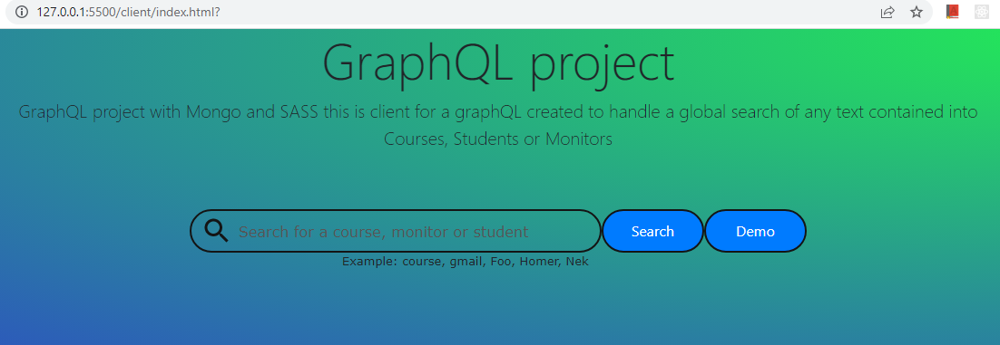
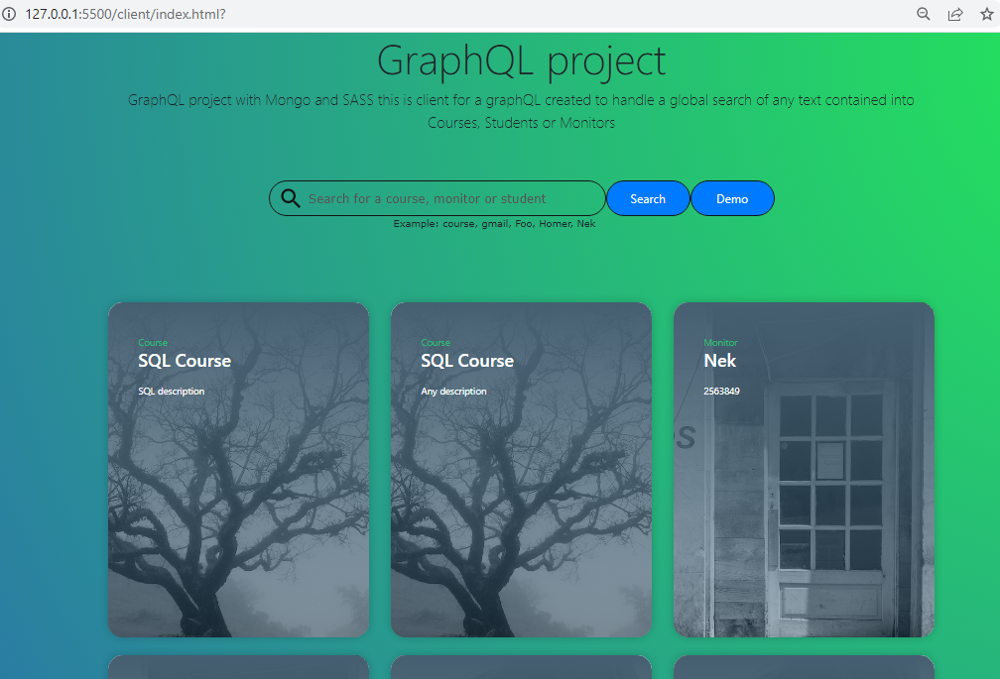

# GraphQL with NodeJS project
GraphQL project with Mongo and SASS to handle some entities like Courses, Students or Monitors
A client was implemented too into the client folder. this client handles a global search of any text found into entities

## Run
### backend
<pre><code>
npm run dev

or

npm start // for production
</code></pre>
### frontend
1. run SASS
<pre><code>
cd client
npm run sass
</code></pre>
2. bundle javascript files
<pre><code>
npm run bundle
</code></pre>
3. load index.html using some Live Server

## Screenshots

## Some Example of Queries and Mutations supported
+ Queries with Alias and Fragments
<pre><code>
{
  AllCourses: getCourses {
    _id
    ...CourseFields
  }
  
  GraphQLCourse: getCourse(id: "639bbfd73cab3e6d46500fb0") {
    _id
    ...CourseFields
  }
  
  NodeCourse: getCourse(id: "639bbfd73cab3e6d46500fb1") {
    _id
    ...CourseFields
    teacher
  }
}

fragment CourseFields on Course{
  title
  description
  people {
    _id
    name
  }
}
</code></pre>

## Mutation with variables
<pre><code>
mutation AddPersonToCourse($courseid: ID!, $personid: ID!)
{
	addPerson(courseId: $courseid, personId: $personid){
    _id
    title
    description
    people{
      name
    }
  }
}
</code></pre>
#### Variables
<pre><code>
{
  "courseid": "639bbfd73cab3e6d46500fb1",
  "personid": "639bd9e639b3cdc8712277c4"
}
</code></pre>

## Query Interfaces
Since Monitor and Students implements the interface Person then we can query them with 
specify properties that belongs to appropriate types, for instance, 
if the query will return a Person which is a Monitor then
only for that the property phone will be shown. The same will occour for Student

<pre><code>
{
 	getPeople{
    _id
    name
    email
    ... on Monitor{
      phone
    }
    ... on Student{
      alias
      avatar
    }
  }
}
</code></pre>

## Query with Directives
The code below will use the @include directive to add a condition is certain properties or fields should be shown or not

<pre><code>
query getPeopleData($monitor: Boolean!, $avatar: Boolean!)
{
 	getPeople{
    _id
    name
    email
    ... on Monitor @include(if: $monitor)
    {
      phone
    }
    ... on Student @include(if: $avatar){
      avatar
      alias
    }
  }
}
</code></pre>

variables

<pre><code>
{
  "monitor": false,
  "avatar": false
}
</code></pre>

## Global Search query example
<pre><code>
{
  searchItems(keyword: "nek"){
    __typename
    ... on Course{
      title
      description
    }
    ... on Monitor{
      name
      phone
    }
    ... on Student{
      name
      avatar
    }
  }
}
</code></pre>

